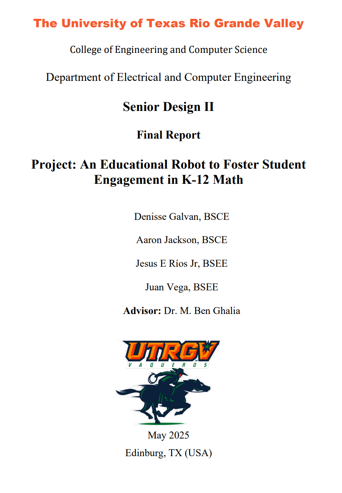

🏎️ Educational Speed Robot

An educational robot that helps K-12 students visualize speed and motion concepts through Bluetooth-controlled demonstrations.
Developed as part of the Senior Design Project (Class of 2025) in Computer Engineering at The University of Texas Rio Grande Valley.

---

🚀 Overview

The Educational Speed Robot is an autonomous line-following vehicle designed to teach embedded control systems concepts such as:

Feedback control using PID algorithms

Sensor integration (reflectance, encoder feedback)

PWM-based motor control and tuning

Bluetooth telemetry and mobile control interfaces

The project integrates hardware, firmware, and a mobile app to create a modular educational platform for real-time control system experiments.

---

⚙️ Key Features

| Category               | Description                                                |
| ---------------------- | ---------------------------------------------------------- |
| **Firmware**           | PID speed control, encoder feedback, BLE command interface |
| **Hardware**           | ESP32 DevKitC, L298N motor driver, QTR-8RC sensor array    |
| **Control Loop**       | Real-time PI loop (20 ms period), dynamic integral limits  |
| **Bluetooth App**      | Flutter app for live speed and gain tuning                 |
| **Performance**        | 0.8 m/s max stable speed, 98 % line tracking accuracy      |
| **Language/Framework** | C++ (Arduino) + Flutter (Dart)                             |

---

📂 Repository Layout

| Folder      | Description                                          |
| ----------- | ---------------------------------------------------- |
| `firmware/` | Embedded C++ source code (`src/` + `include/`)       |
| `hardware/` | Wiring diagrams, schematics, and 3D models           |
| `docs/`     | Final report, presentation, and supporting materials |
| `images/`   | Prototype photos and testing images                  |
| `app/`      | Flutter mobile app for Bluetooth control             |
| `LICENSE`   | MIT License                                          |

---
## 📘 Project Documentation

The complete technical documentation for this project is available in the [`docs/`](docs) directory.

📄 [Open Final Report (PDF)](docs/Final_report.pdf)

The report includes:
- Hardware and software design overview  
- Control loop implementation (PID and sensor integration)  
- BLE interface and firmware architecture  
- Experimental setup, data collection, and performance results  
- System validation and conclusions  

---
📸 Gallery

---

🧰 Tools & Technologies

MCU: ESP32 DevKitC

Programming: C/C++ (Arduino), Dart (Flutter)

Motor Driver: L298N Dual H-Bridge

Sensors: Pololu QTR-8RC Reflectance Array

IDE: Arduino

---