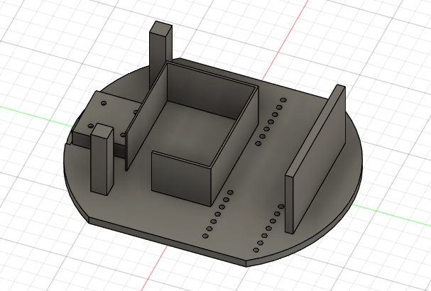
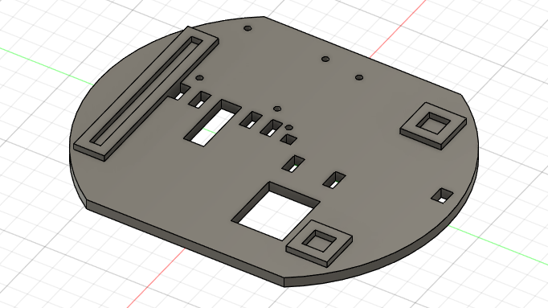
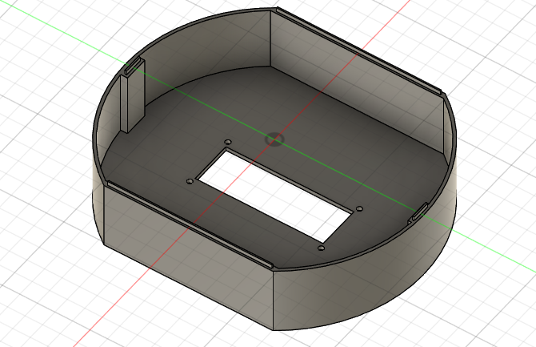
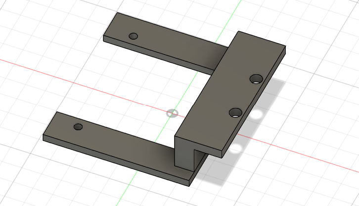

## 3D Robot Chasis Design & supporting software specifcations

#### Software:
AutoDesk Fusion 360
#### Print configuration:
BambuLab A1 mini PLA material

- layer height 0.2 mm
- infill Density 30%
- pattern gyroid
- nozzle temp 215 C
- bed temp 65 C

                                                      

---
### 3D models
Bottom Chasis design with M.2 holes for motor mounts.

